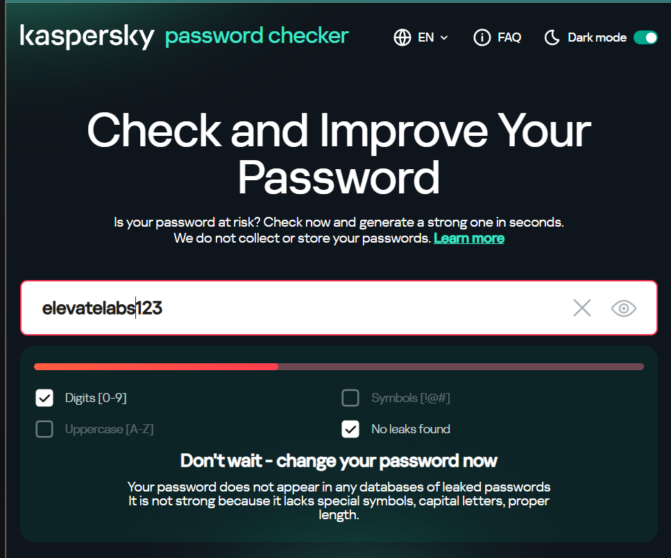
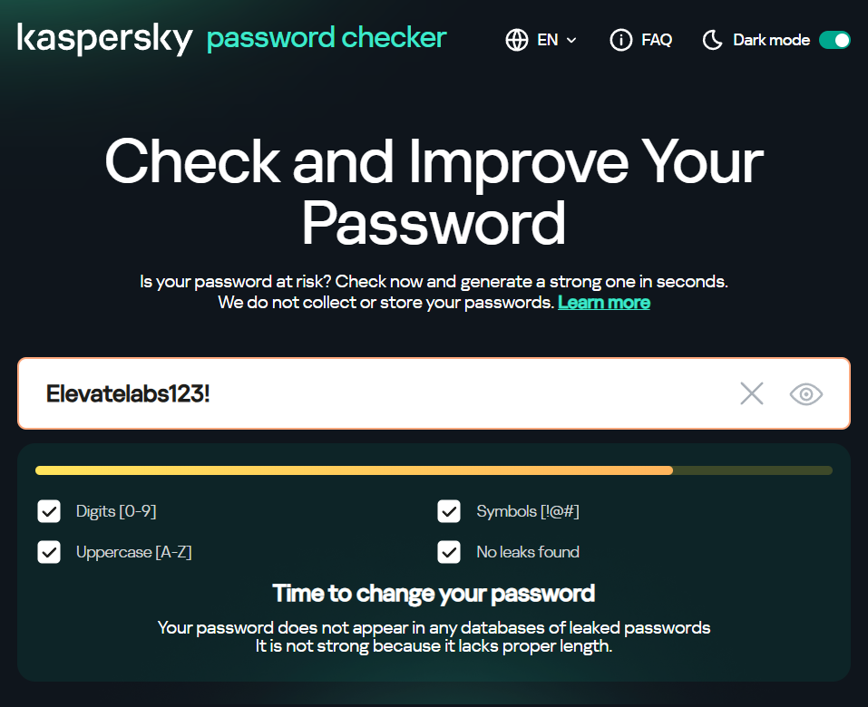
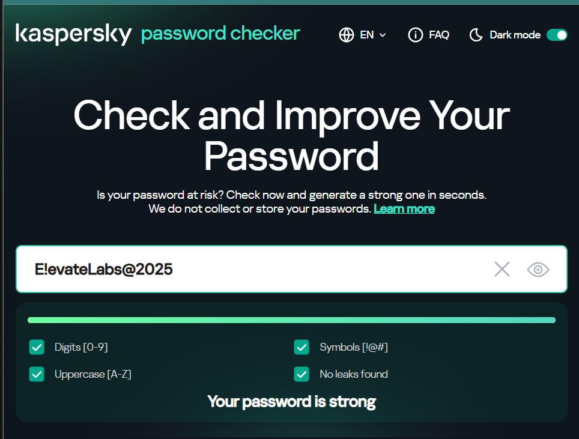
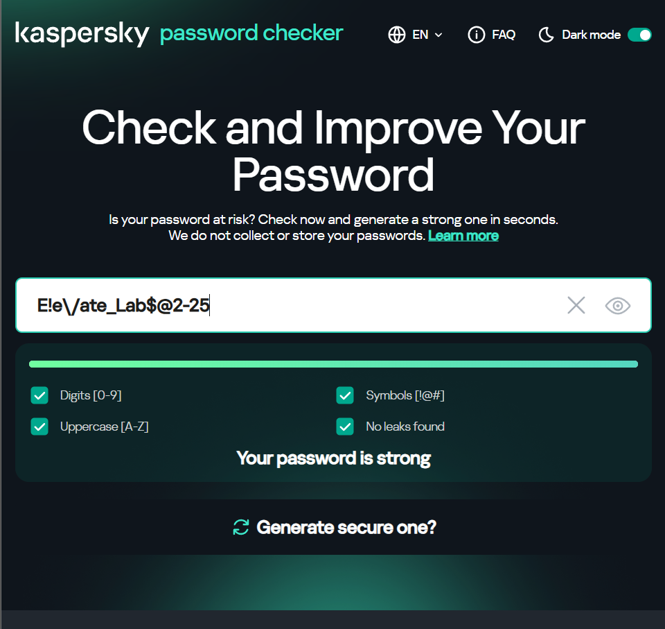

# Elevate-labs-Cybersecurity-Task-06
A repository for the task 06 from the Elevate labs, Cybersecurity

# Task 6: Password Creation & Strength Evaluation

## Overview

This project demonstrates hands-on skills in creating and evaluating password strength, as part of the Elevate Labs Cyber Security Internship. Screenshots from Kaspersky Password Checker illustrate the scores for different passwords with varying complexity.

## Screenshots

All score images are stored in the `screenshots/` directory.

| Password Tested        | Screenshot                        | Strength     | Notes/Feedback                                           |
|----------------------- |-----------------------------------|--------------|---------------------------------------------------------|
| elevateLabs123         |      | Weak         | No symbols, lacks proper length, missing uppercase       |
| Elevatelabs123!        |  | Medium       | Length OK, digits and symbol included, not long enough   |
| E!evateLabs@2025       |  | Strong       | Has digits, uppercase, symbol, long, no leaks found      |
| E!e\vate_Lab$@2-25     | | Very Strong | Uses digits, symbols, uppercase, long and complex        |

## Password Strength Analysis

- Passwords with a mix of uppercase, lowercase, numbers, and symbols, and a longer length, consistently scored as "strong" or "very strong".
- Simple passwords lacking symbols and sufficient length were marked as weak.
- Feedback from Kaspersky checker emphasizes the importance of length and mixed character types.

## What Makes a Password Strong?

- Length: Aim for 12+ characters.
- Complexity: Mix uppercase, lowercase, numbers, and symbols.
- Unpredictability: Avoid dictionary words, names, dates, or easy patterns.
- Avoid reuse: Never repeat passwords across accounts.

## Common Password Attacks

- **Brute Force Attack**
  - Attackers systematically try every possible combination of characters until the correct password is found.
  - Automated tools accelerate this process, making short or simple passwords especially vulnerable.

- **Dictionary Attack**
  - Uses a pre-built list of common words, phrases, and passwords to attempt logins.
  - Targets passwords based on dictionary words or common substitutions, greatly reducing the number of guesses needed.

- **Credential Stuffing**
  - Leverages username and password pairs stolen from previous data breaches.
  - Attackers automate login attempts on various platforms, exploiting password reuse by users.

- **Phishing Attack**
  - Involves tricking users into revealing their credentials using fake websites, emails, or messages.
  - Often exploits social engineering tactics to induce urgency or fear.

- **Rainbow Table Attack**
  - Attackers use a precomputed table of hashed passwords to reverse hashed values quickly.
  - Works best when passwords are unsalted and common hashing algorithms are used.

- **Keylogging**
  - Malicious software records keystrokes, secretly capturing passwords and usernames as users type them.
  - Keyloggers are often installed via malware-laden downloads or phishing.

- **Password Spraying**
  - Tries a small list of commonly used passwords (like “Password123”) across many different user accounts.
  - Designed to avoid account lockout mechanisms that trigger after multiple failures on a single account.

- **Man-in-the-Middle Attack**
  - Attackers intercept communications between the user and a legitimate service, potentially capturing credentials sent in clear text or during session hijacking.

---

## Best Practices for Strong Passwords

- Use a passphrase or random word combinations (e.g., `Blue$Tree!Horse197`).
- Never include personal info (name, birthday).
- Prefer longer passwords (16+ characters if possible).
- Use a password manager to generate/store unpredictable passwords.
- Enable Multi-Factor Authentication (MFA) whenever available.

## Interview Question Responses

**1. What makes a password strong?**  
A strong password uses a mix of uppercase, lowercase, digits, symbols, is at least 12 characters, and is not based on dictionary words.

**2. What are common password attacks?**  
Brute force, dictionary attacks, phishing, credential stuffing.

**3. Why is password length important?**  
Long passwords are harder to guess or brute-force due to exponential increase in combinations.

**4. What is Multi-Factor Authentication (MFA) and why should you use it?**  
MFA requires an additional factor (e.g., code from your phone) so even if a password is breached, account access is still protected.

**5. What is a password manager?**  
A secure tool that generates, stores, and autofills strong/random passwords for all online accounts.

## Summary

This documentation and collection of screenshots verifies hands-on practice with password creation and analysis tools. Follow best practices to maximize your account security.

---
